# LR6

# Лабораторная работа №6

## Цель работы

Изучение базовых возможностей системы управления версиями, опыт работы с Git Api, опыт работы с локальным и удаленным репозиторием.

## Ход работы

1. Создание копии в личное хранилище из https://github.com/Kurtyanik/LR6/.

2. Настройка клиента git, путем ввода имени пользователя и email.
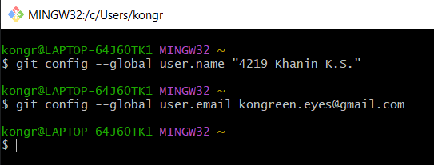

3. Клонирование личного удаленного репозитория на компьютер.
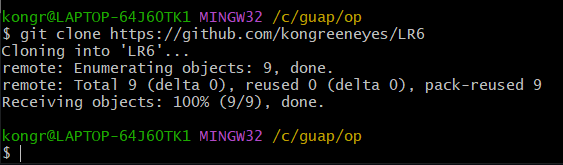

4. Добавление файла через интерфейс GitHub.
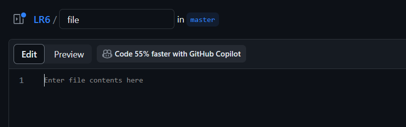

5. Подтягивание изменение в локальный репозиторий.
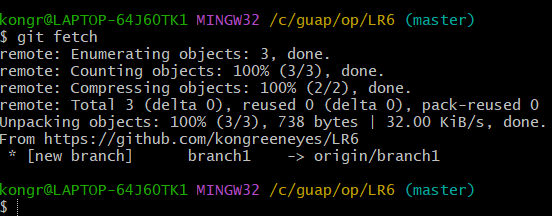

6. Подтягивание изменений и переход в ветку branch1.
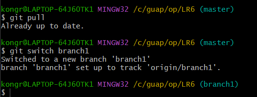

7. Общая история операций для веток master и branch1.
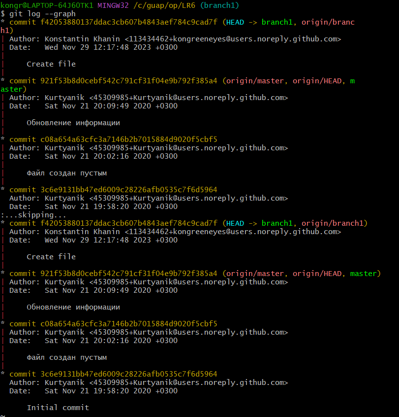

8. Сохранение изменений после редактирования файла в ветке master.
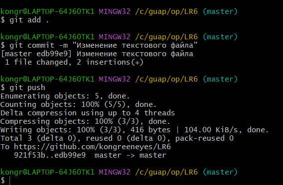

9. Сохранение изменений после редактирования файла в ветке branch1.
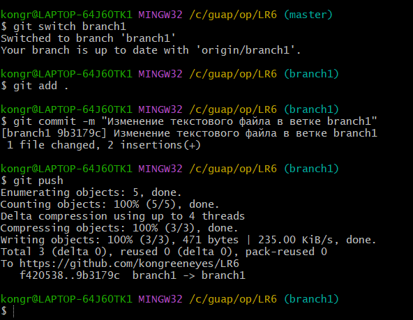

10. Слияние веток branch1 и master в ветку master.

11. Сохранение повторных изменений файла mergefile в ветке branch1.

12. Повторное слияние веток branch1 и master в ветку master.
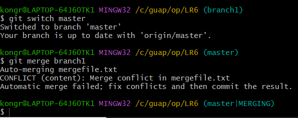

13. Слияние вручную из-за возникшего конфликта.
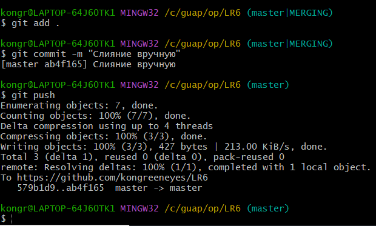

14. Графическое отображение истории операций над ветками.
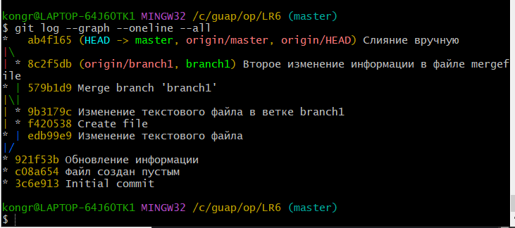

15. Удаление ветки branch1.
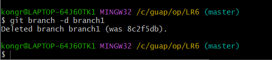

16. Сохранение новых изменений в файле mergefile.
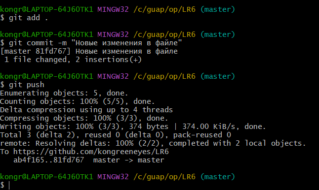

17. Сохранение еще одних изменений в файле mergefile.
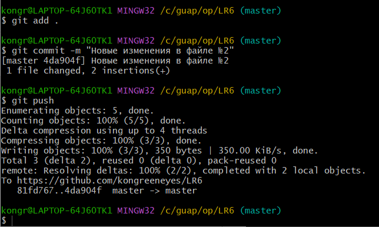

18. Сохранение других изменений в файле mergefile.

19. Откат последнего коммита.
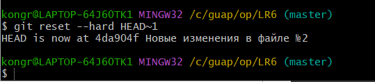

20. Графическое отображение истории операций над ветками.
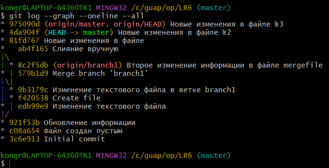
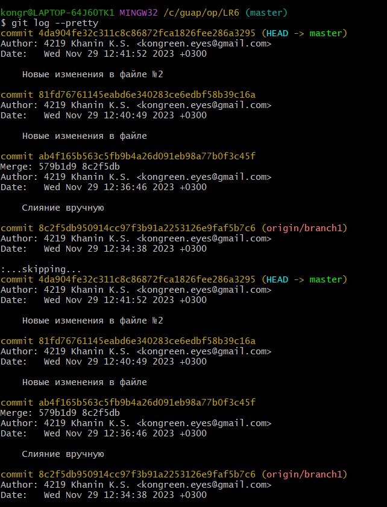
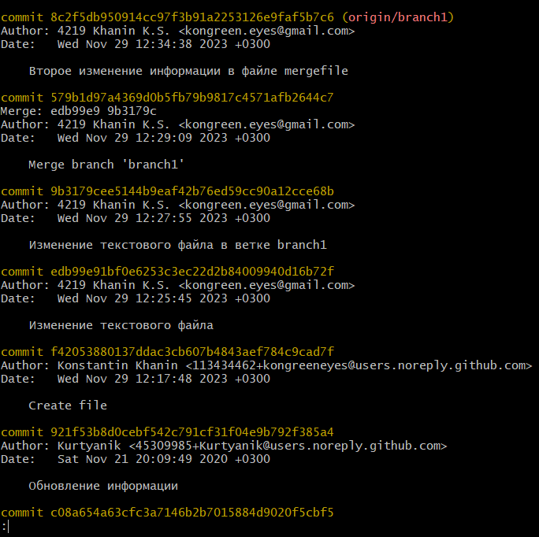

21. Создание ветки report для отчета.
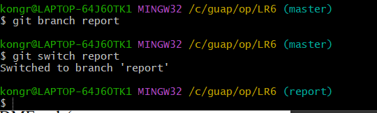

22. Скриншот отчета в редакторе Visual Code.
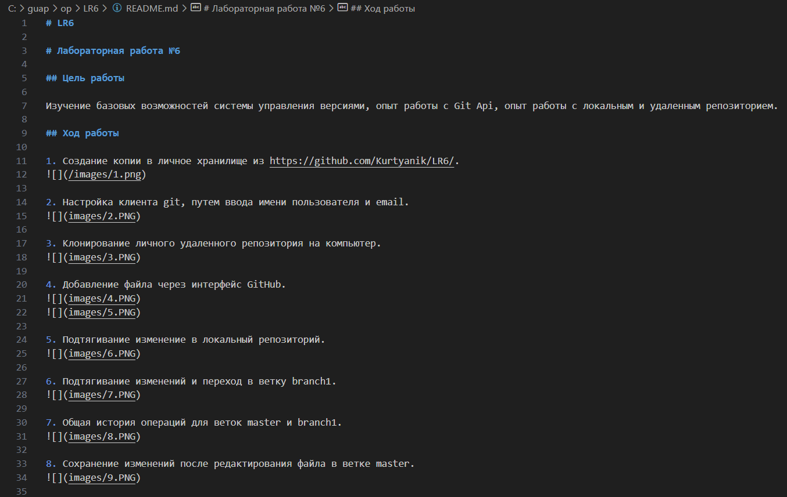
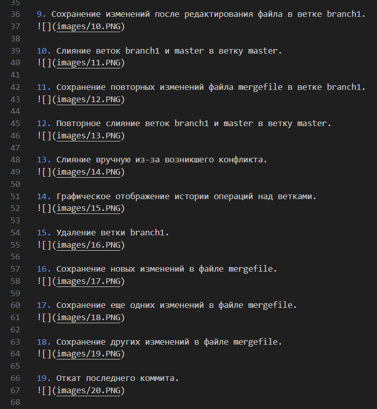
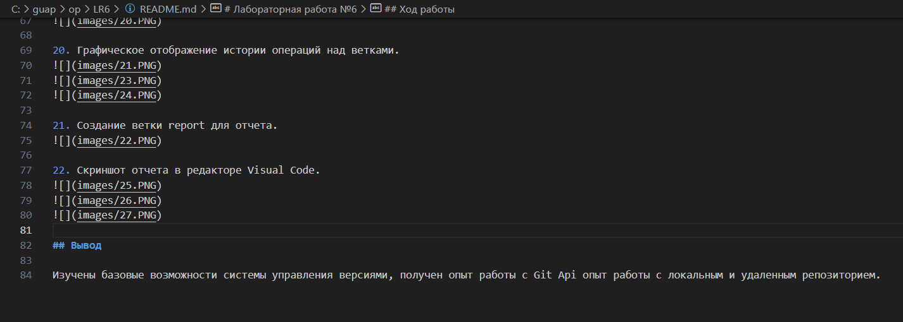

## Вывод

Изучены базовые возможности системы управления версиями, получен опыт работы с Git Api опыт работы с локальным и удаленным репозиторием.